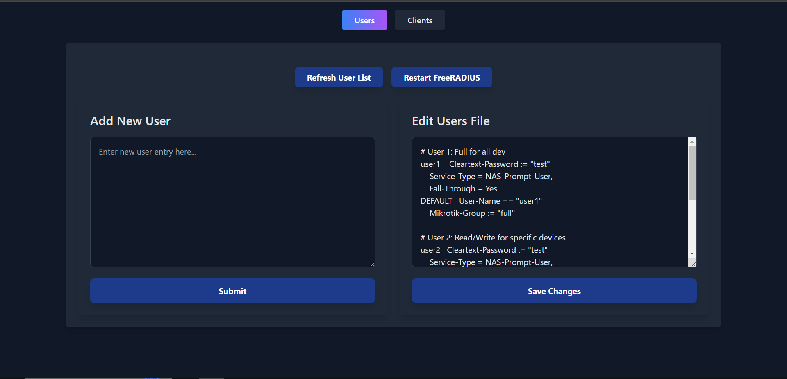

# FreeRadius_UI

A simple tool to manage FreeRADIUS configuration files via a web interface. ⚠️ Not secure for production or public use. For local setups only.

# FreeRADIUS UI

A web-based interface to manage FreeRADIUS users and configurations. This tool allows you to add, update, and manage FreeRADIUS users easily without requiring direct access to the server.

---

## Screenshot



---

## Installation Steps

1. **Clone the Repository**:
   ```bash
   git clone https://github.com/<your-username>/freeradius-ui.git
   cd freeradius-ui
   Install Backend (Server):
   ```

Navigate to the server directory:
bash
Copy code
cd server
Install dependencies:
bash
Copy code
npm install
Start the backend:
bash
Copy code
npm start
Install Frontend (Client):

Navigate to the client directory:
bash
Copy code
cd ../client
Install dependencies:
bash
Copy code
npm install
Update the .env file with your backend URL:
Create a .env.local file in the client directory and add:
arduino
Copy code
REACT_APP_API_URL=http://<your-server-ip>:3000
Start the frontend:
bash
Copy code
npm start
Configure Permissions:

Ensure the FreeRADIUS configuration files are writable by the user running the backend:
bash
Copy code
sudo chown -R <your-username> /etc/freeradius
sudo chmod -R 755 /etc/freeradius/3.0
Specifically, ensure /etc/freeradius/3.0/users is writable:
bash
Copy code
sudo chmod 644 /etc/freeradius/3.0/users
Run FreeRADIUS Without sudo: Ensure your backend can restart FreeRADIUS without requiring sudo password:

Edit the sudoers file:
bash
Copy code
sudo visudo
Add the following line (replace <your-username>):
css
Copy code
<your-username> ALL=(ALL) NOPASSWD: /bin/systemctl restart freeradius
Usage Instructions
Open the web application in your browser.
Add a New User:
Use the left-side panel to add a new user entry.
Click Submit.
Edit Existing Users:
Use the right-side panel to modify the users file directly.
Click Save Changes.
Refresh User List:
Click the Refresh User List button to reload the users file.
Restart FreeRADIUS:
Click the Restart FreeRADIUS button to apply the changes.
Notes
After adding a new user or editing the configuration, always refresh FreeRADIUS using the "Restart FreeRADIUS" button.
Ensure proper file permissions to avoid issues during configuration changes.
